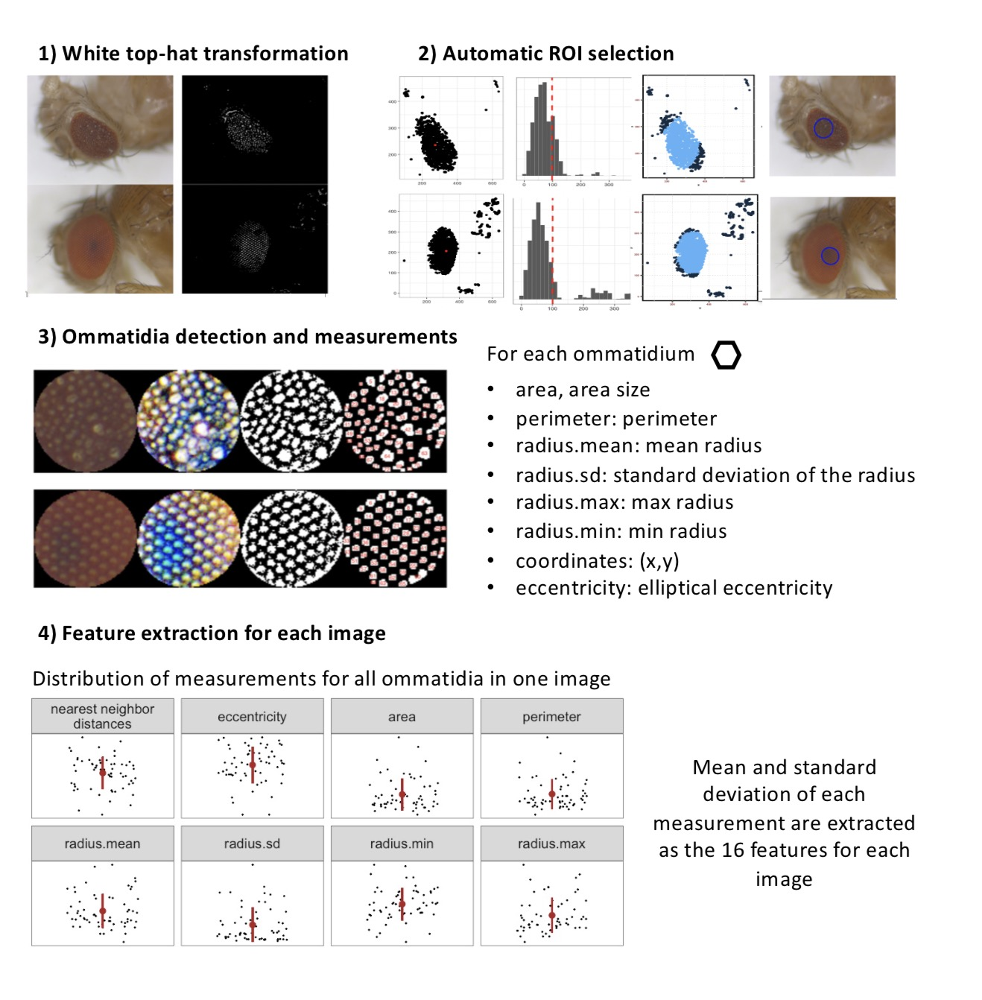

# fly.eye.pat
An automated images analysis pipeline implemented in R scripts which quantifies the ommatidia regularity pattern for each fly eye image.




### 1. organize images, distribute them into different DGRP lines folders

image name rule: GroupXX.dayXX.R32_XX_XX.jpg

an example: Group27.day28.R32_21_2.jpg

```
perl ./code/check.jpg.count.pl raw-Group-27-Images/ > check.out
mkdir lines;
nohup perl ./code/distribute.into.lines-v2.pl ./raw-Group-27-Images/ ./lines/ > lines.out.txt &

#check for total image number
perl ./code/check.jpg.count.pl lines/ | grep 'total'
>#total day28 jpg: 6
>#total jpg: 6

perl ./code/quick.check.pl lines/ |  awk 'BEGIN{a=0}{a=a+$2}END{print a}' - 
>6

grep '^R' lines.out.txt | awk 'BEGIN{a=0}{a=a+$3}END{print a}' - 
>6

grep '^RAL' lines.out.txt >lines.summary.txt
```

### 2. use fly.eye.pat R scipt pipeline to process images

```
mkdir result;
cd result/
perl ../code/make.sh.pl ../lines >my.txt &
grep 'nohup' my.txt >my.sh

chmod 755 my.sh
nohup ./my.sh &
```

### 3. based on basic ommatidia measurements, compute the ommatidia layout pattern

```
cd ..;
perl ./code/get-nn-mean-sd.pl result/ >nn-out.txt &
perl ./code/get-area-mean-sd.pl result/ >area-out.txt &
wc -l *txt
>    7 area-out.txt
>    7 nn-out.txt
```

There is one filtering condition for each image in the above two perl scripts:

- for each image, remove the largest 3 and smallest 3 ommatodia measurements. 
- if the number of remaining ommatidia is larger than 6, keep this image. 

Which means, an 'effective' image would contain >12 ommatidia.


The ***17 measurements*** extracted from each eye image:

- npoint: the number of ommatidia in each fly eye ROI
- nn.mean: mean of nearest neighbor distances
- nn.sd: sd of nearest neighbor distances	
- cc.mean: mean of ommatidia circularity	
- cc.sd: sd of ommatidia circularity	
- mean.s.area: mean of ommatidia area
- sd.s.area: sd of ommatidia area
- mean.s.perimeter: mean of ommatidia perimeter 
- sd.s.perimeter: sd of ommatidia perimeter 
- mean.s.radius.mean: mean of distribution of ommatidia radius mean
- sd.s.radius.mean: sd of distribution of ommatidia radius mean
- mean.s.radius.sd: mean of distribution of ommatidia radius sd
- sd.s.radius.sd: sd of distribution of ommatidia radius sd
- mean.s.radius.min: mean of distribution of minimal ommatidia radius 
- sd.s.radius.min: sd of distribution of minimal ommatidia radius 
- mean.s.radius.max: mean of distribution of maximal ommatidia radius 
- sd.s.radius.max: sd of distribution of maximal ommatidia radius 

### 4. plot image summary statistics distribution in R.

```

library(ggpubr);library(ggplot2);library(dplyr);library(purrr);library(gridExtra)
# read in data
df1=read.table("nn-out.txt",header = T,as.is=T);
df2=read.table("area-out.txt",header = T,as.is=T);
x=sapply(df1$imageID,function(x){unlist(strsplit(x,'.jpg' ))[1] })
df1$imageID=unname(x);
x=sapply(df2$imageID,function(x){unlist(strsplit(x,'.jpg' ))[1] })
df2$imageID=unname(x);
df<-cbind(df1,df2[-c(1,2)]);

# dfa: extract line, day, group values from imageID name(eg:group5.day28.R32.Ral_804_5.jpg)
dfa=data.frame();
for(i in 1:nrow(df)){
  name=df[i,'imageID'];
  a=unlist(strsplit(name,'\\.'));
  b=unlist(strsplit(a[1],'\\-'));
  group=b[2];
  day= as.numeric(gsub("day", "", a[2],ignore.case = T));
  line=as.character(unlist(strsplit(name,'_')))[2];
  dfa[i,'group']=group;
  dfa[i,'line']=as.numeric(line);
  dfa[i,'day']=day;
}

df.o=cbind(dfa,df); #dfa:name, class:add.1.var, df:data
sum(df.o$npoint<=20)
df.o=df.o[df.o$npoint>20,]
n.image=nrow(df.o);

# Distributions of different measurements
par(mfrow=c(4,4),mar=c(1,1,2,1),mgp=c(0,0.3,0))
for(i in 6:ncol(df.o)){
  hist(df.o[,i],main=colnames(df.o)[i],cex.main=0.8,xlab='',ylab='',
       cex.axis=0.6,cex.lab=0.6,breaks=20)
}

df.log=apply(df.o[,-(1:5)],2,log);

# Distributions of different measurements after log-transformation
par(mfrow=c(4,4),mar=c(1,1,2,1),mgp=c(0,0.3,0))
for(i in 6:ncol(df.log)){
  hist(df.log[,i],main=colnames(df.log)[i],breaks=20,
       cex.main=0.8,xlab='',ylab='',cex.axis=0.6,cex.lab=0.6)
}

```
